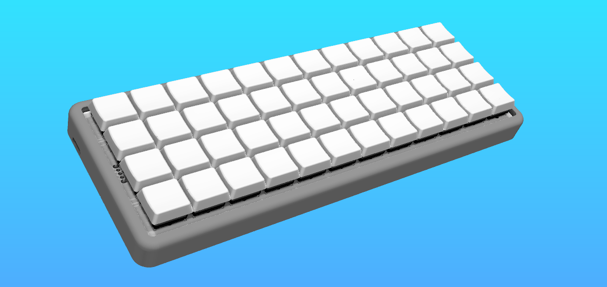
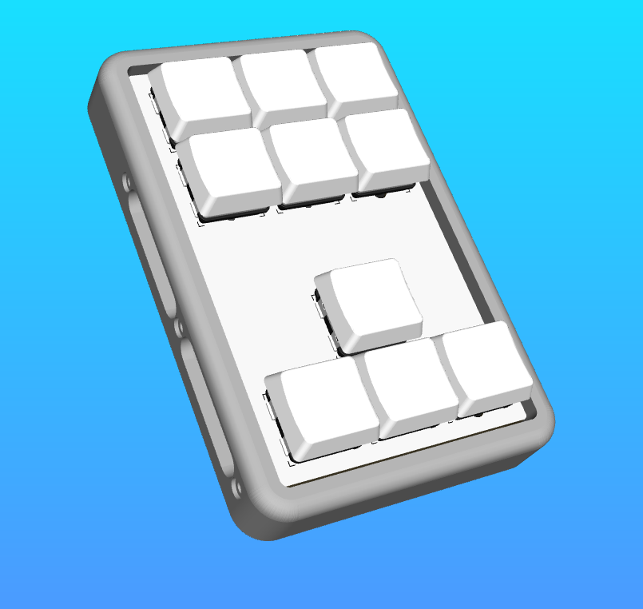
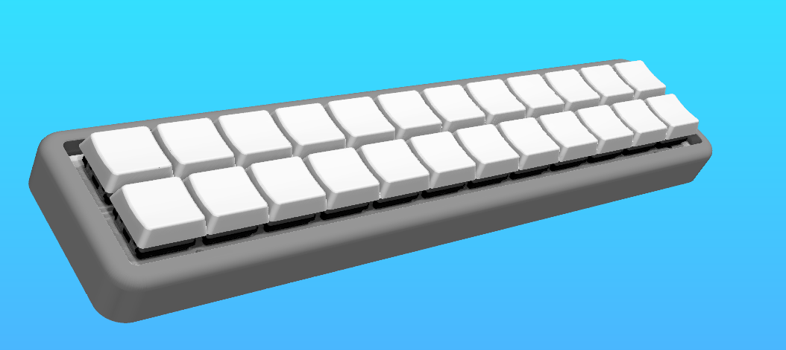

# AFF314MODKEEB
AFF314MODKEEB is a 4x12 lowprofile keyboard. What makes it special are its modules. You can attach modules on top or on the right side which are connected with are then connected by magnets.

I had the idea because I daily drive 40% and 75% keyboards. I wanted to have one keyboard which can be used for both. With this keyboard you can have a full sized keyboard with number-keys, f-keys and arrow keys if you need it for a game or programm. But if you want to have a more minimal keyboard you can just detach the modules and have a nice and compact 40% keyboard. 

## Modules
You can attach the modules on top and on the right side.
So far I have designed three modules.

One for the right side. It has arrow-keys plus six extra keys that can be used for what ever you like.

The two that go on top are either a number or f-key row or a number plus f-key module. I decided to only order the pcbs for the number plus f-key module since you can type the numbers and f-keys also with layers so when I really need the f-keys or numbers the others don't hurt and it would take away from that convenience I wanted if you have so many modules laying around.

If you want to you can design your own modules. You can use the same cases I designed and you have to modify the [pcbs](./pcb).

## Building
If you want to build the keyboard you have to not only solder on the pcb but also solder some wires. Once the keyboard is built I will add pictures for better understanding.

### Flashing
To flash the firmware you have to download the [UF2 file](./firmware/firmware.uf2).

### PCB
On the pcbs you first have to solder on all the diodes and hotswap sockets. Then you can solder on the power switch if you want to use one, because you can also use it without a powerswitch and solder the battery directly or just use it wired.

### Connectors
Before we wire everything we need the prepare the connectors. For this you need to print the [mounting bracktets](./3d). Then you can melt the heat inserts in the mounting bracket and attach it to the magnetic connector.

### Case
We also need to prepare the case. This is pretty straight forward as you only need to add the heat inserts.

### Wiring
We will start with the magnetic connectors we have prepared. We need to wire the cables to the pins. It is probably a good idea to use heat shrink tubing to isolate the exposed pins right by eachother but you dont have to. Once the wires are soldered to them we take them and mount them inside the case.
Look at the [schematics](./pics) and at the [wiring_guides](./pics) for help.

You can wire them to the mcu now. You also need to wire the rows and columns from the pcb to the mcu. For this you can take a look at the pcb but I will also add pictures once it's build.
At last you can wire the battery.
